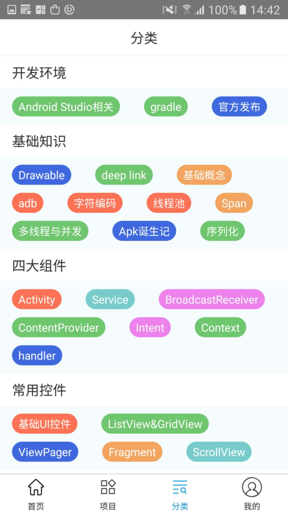
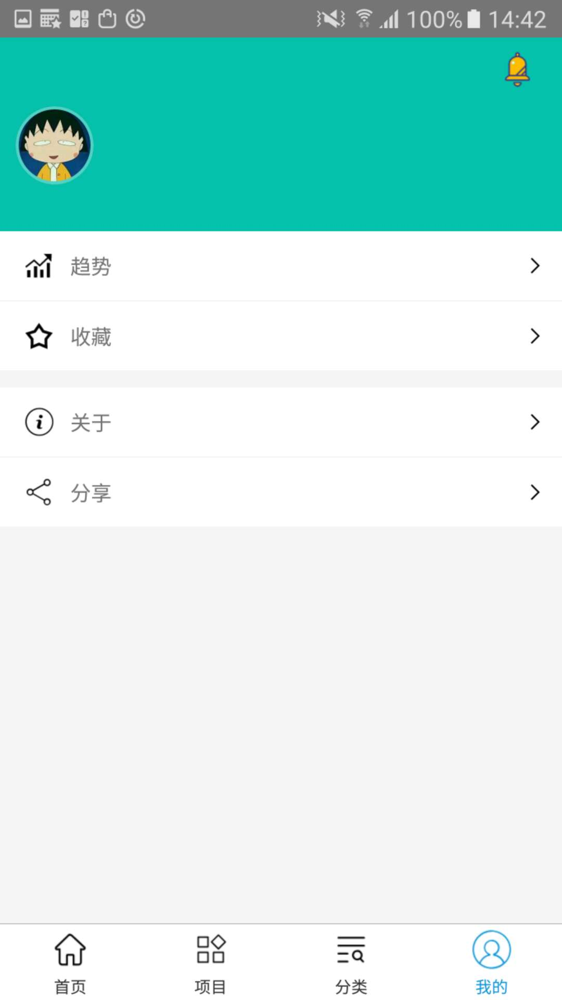
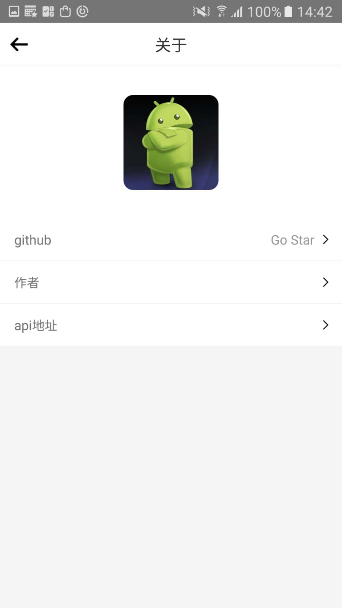
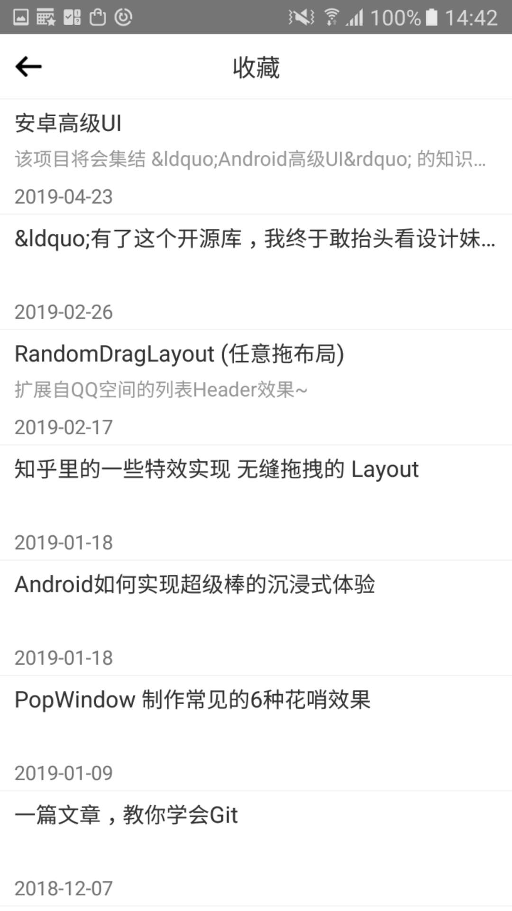

# RN-wanAndroid
A wanAndroid project  Coding by RN
#### 引言
由于公司准备把所有的项目用RN进行重写,所以最近学习了一段时间的RN,简单写了个wanAndroid的小项目主要内容如下
#### 项目截图

#### 总结
RN是facebook出的一个跨平台方案,体验我觉得一般,不过最近听说facebook正在对RN进行内核优化,也不知道最后的结果是什么,相比于Flutter,我更喜欢Flutter,对Android开发来说,开发起来更友好,RN开发起来是真的难受.
#### 项目地址
[https://github.com/mouxuefei/RN-wanAndroid](https://github.com/mouxuefei/RN-wanAndroid) 